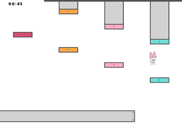

# Agent J: Missing Testtube

A simple Python game where players can Jump from a Platform into another Platform. The Objective is to reach the Top Level, there is a Testtube waiting for you! so yeah, this is just like Jump King.

## Game Mechanics
**Jump** : hold Space bar to charge your Jump and release it to Jump

**Move** : press A or D to move Left or Right

## Installation
To run the Game you need to install Python locally and its dependency (pygame). To install python you can download it from the website https://www.python.org/downloads/ and to install pygame you need to run this command in cmd “pip install pygame”. Then open main.py in an IDE then run it.

If you have Python installed already, u can double click “Run.bat”, this will automatically installing pygame and run the Game.

If you don’t have python installed and don’t want to install it, you can run “Missing Testtube.exe”.

## Screenshot

